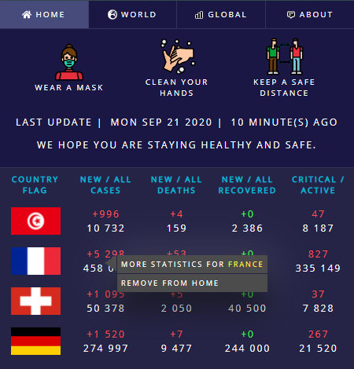
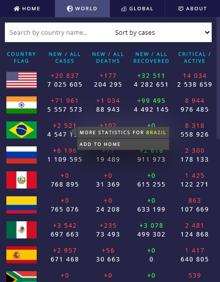
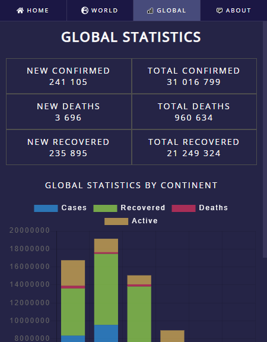
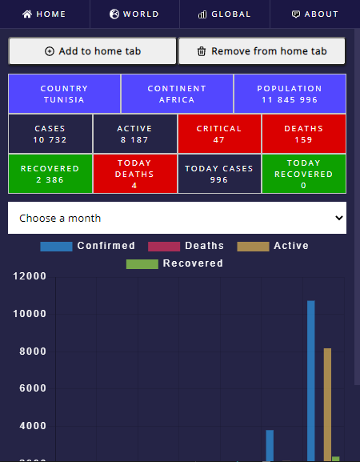
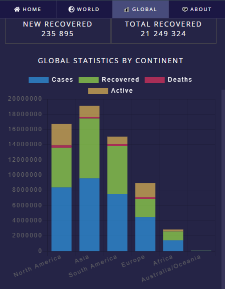

    
  <h1 style="margin:0">CovidNow</h1>
  <h4 style="margin-top:0">A Free browser extension</h4>
  
🦠 😷 for Tracking coronavirus global spread 🔬🌡

     

# Installation
- [Firefox](https://addons.mozilla.org/firefox/addon/covidnow)
- [Edge Chromium](https://microsoftedge.microsoft.com/addons/detail/covidnow/ndohbioafkjajehnnkhflkmkmoakakda)

### Captures

### License
MIT